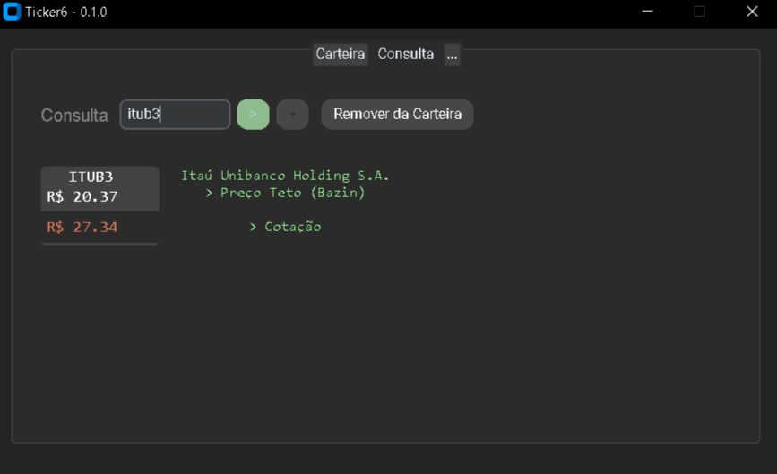
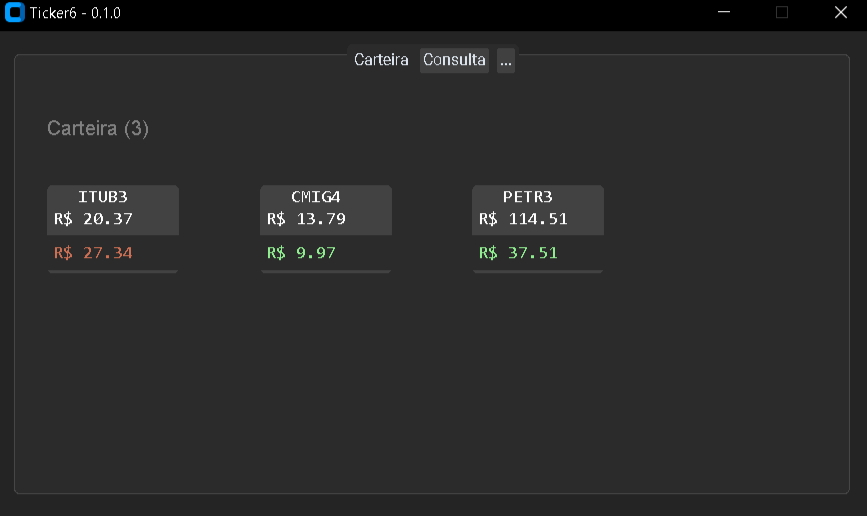

# Sobre o projeto

Este programa é um projeto individual em andamento que pode ser utilizado por estudantes ou investidores. Por trás da interface gráfica [(CustomTkinter)](https://github.com/TomSchimansky/CustomTkinter) existe um algoritmo que é muito simples e prático, escrito na linguagem de programação Python. 

Ticker6 é o nome do programa e, com ele, você poderá consultar a cotação atualizada das ações e vizualizar o preço teto sem a necessidade de calcular e buscar os dados pela internet. Também é possível armazenar os ativos favoritos em uma carteira. Por enquanto, o programa é dependente dos dados fornecidos pela biblioteca [yFinance](https://github.com/ranaroussi/yfinance) (Apache License). 

Faça o teste e aproveite!

# O código

- O código foi escrito propositalmente em português (sem considerar as palavras reservadas em inglês da própria linguagem).
  
- Há duas variáveis importantes que estão destacadas no início do código e que podem ser alteradas, influenciando no cálculo do preço teto gerado pelo programa. Por padrão, elas são definidas como `dy = 0,06 (6%) | anos = 5`.
  
- Sobre a modularização, o código principal executável é `main.py` e faz requisição a uma lista de ativos validos que está em `validos.py`.
  
- O código faz a criação de um arquivo `.ativos.txt` onde estará registrado todos os ativos permanentes que o usuário definir dentro do programa. 

# Como usar

Você precisará do arquivo `main.py` que será executado, e do arquivo `validos.py` que é necessário para o funcionamento do programa. Apenas deixe-os na mesma pasta (como no repositório); por fim, será necessária a instalação das bibliotecas.

Como em qualquer outro repositório, ao fazer o download ou clonagem, os arquivos já estarão na estrutura ideal para uso. Contanto que o usuário mantenha os arquivos citados acima no mesmo diretório, não haverá problemas para iniciar.

# Requisitos

- Python 3.12
- yFinance 0.2.40
- CustomTkinter 5.2.2
  
---
Você pode fazer o download das bibliotecas dentro do ambiente utilizando o arquivo `requirements.txt` que está no repositório, e com o comando `pip install -r requirements.txt` você fará a instalação das bibliotecas necessárias diretamente do arquivo. 

E claro! também é possível fazer a instalação utilizando o `pip install [biblioteca]`.

---

# O que é o preço teto de uma ação?

O Preço Teto é o valor máximo que um investidor está disposto a pagar por uma ação e faz parte de uma estratégia previdenciária que busca um retorno mínimo esperado de dividendos. Esse valor pode ser calculado de diferentes formas, dependendo do perfil do investidor. De maneira simples, utiliza-se os dividendos pagos por uma ação e o Dividend Yield desejado.

Aqui, utilizamos parte do Método [Bazin](https://pt.wikipedia.org/wiki/D%C3%A9cio_Bazin) e consideramos a média de dividendos pagos durante 5 anos e um Dividend Yield esperado de 6%.

	Preço Teto = (Média Dividendos) /  6%
 
Uma vez estabelecido um Preço Teto, se o preço de mercado da ação estiver acima do Preço Teto, podemos considerar a ação **sobrevalorizada** e não recomendada para compra. Se o preço da ação estiver abaixo do Preço Teto, a ação está **subvalorizada** e é recomendada, segundo a estratégia.

É **importante** não confundir o Preço Teto com o _preço justo_ ou o _preço alvo_ de uma ação, pois o Preço Teto é apenas uma margem de segurança que o investidor pode utilizar para comprar uma ação por um valor aceitável, olhando apenas o potencial de remuneração da empresa. 

E não é apenas o indicador de Preço Teto que deve ser considerado na compra de uma ação, e ele pode não significar nada se utilizado de maneira inadequada. É recomendável que o investidor tome suas decisões com cautela e faça uma análise da saúde financeira da empresa e do modelo de negócio, levando em consideração seus objetivos pessoais. 

---
  
	
